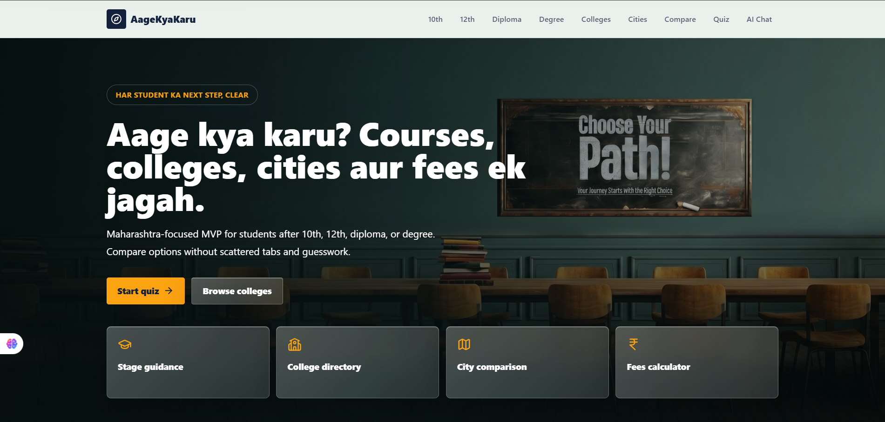
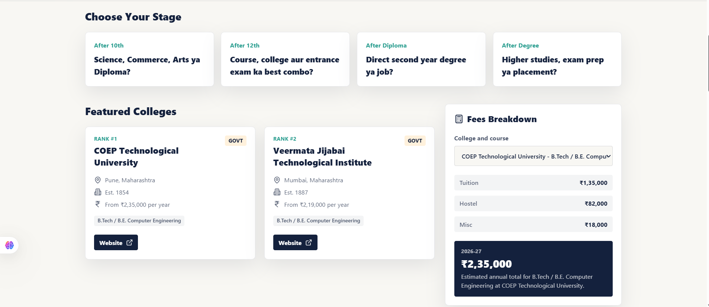
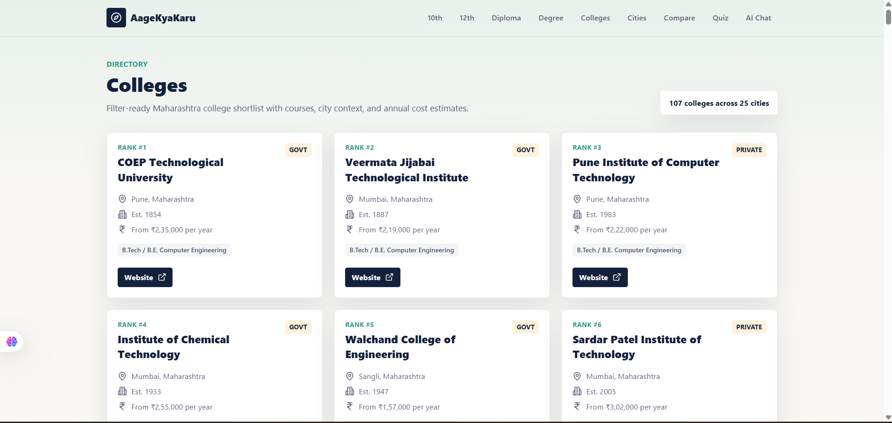
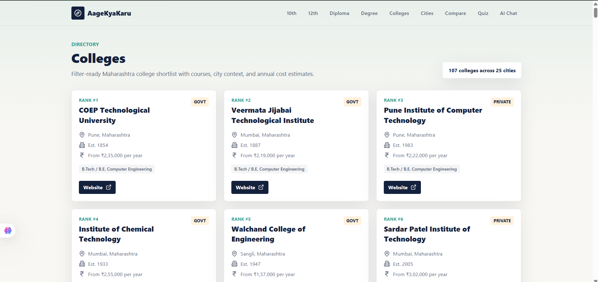
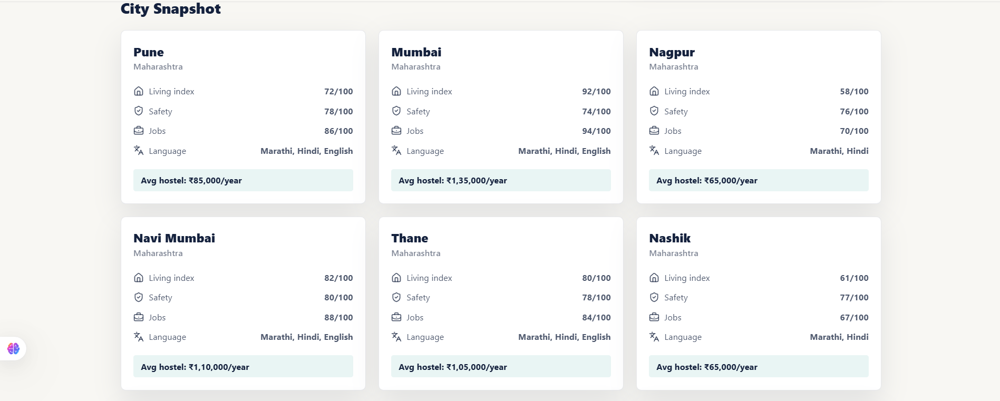
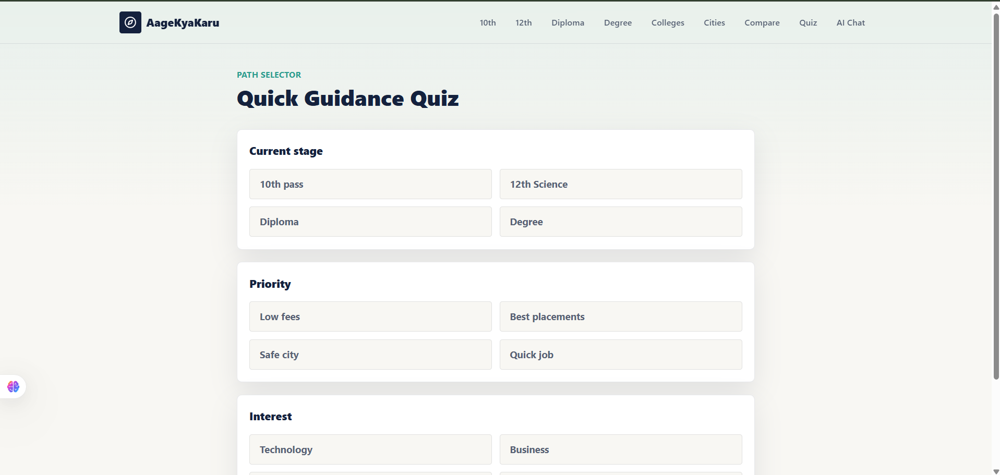
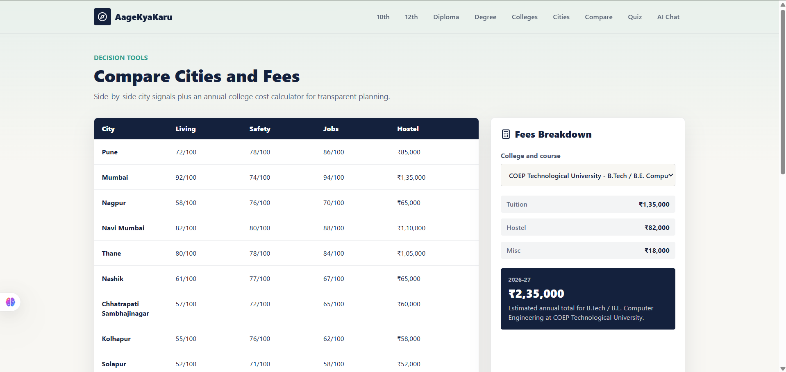
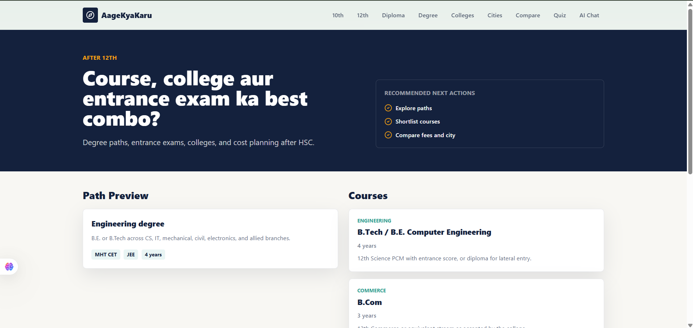

# AageKyaKaru

Student guidance MVP for answering "ab aage kya karu?" after 10th, 12th, diploma, or degree.

## Screenshots

### Home





### Colleges and Cities







### Guidance Tools







## What is included

- Next.js 14 App Router project
- Tailwind CSS styling
- Maharashtra-focused seed data for Pune, Mumbai, and Nagpur
- Stage pages for after 10th, 12th, diploma, and degree
- College directory, city comparison, fees calculator, hostel cards, and quick quiz
- Supabase schema and seed SQL in `supabase/`

## Run locally

```bash
npm install
npm run dev -- --hostname 127.0.0.1 --port 3000
```

Then open `http://127.0.0.1:3000`.

If PowerShell blocks `npm`, use:

```powershell
npm.cmd run dev -- --hostname 127.0.0.1 --port 3000
```

## Supabase setup

1. Create a Supabase project.
2. Run `supabase/schema.sql` in the SQL editor.
3. Run `supabase/seed.sql` in the SQL editor.
4. Copy `.env.example` to `.env.local` and fill:

```bash
NEXT_PUBLIC_SUPABASE_URL=
NEXT_PUBLIC_SUPABASE_ANON_KEY=
OPENAI_API_KEY=
OPENAI_MODEL=gpt-5.5
```

The current UI renders from local seed data in `data/stages.ts`; the Supabase client is ready in `lib/supabase.ts` for the next phase.

## AI chat

The AI guidance chat is available at `/chat`. Add `OPENAI_API_KEY` to `.env.local`, then restart the dev server. `OPENAI_MODEL` is optional and defaults to `gpt-5.5`.

## Verification

```bash
npm run typecheck
npm run lint
npm run build
```
